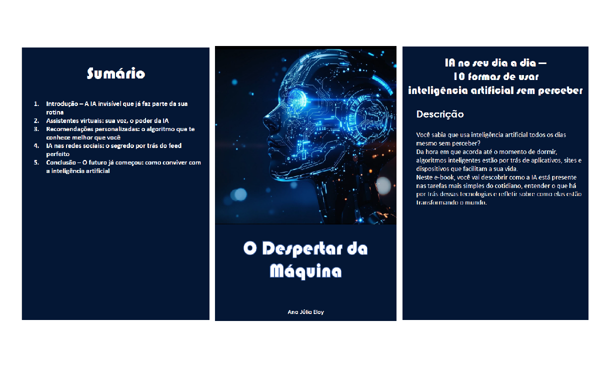

# Projeto EBOOK Gerado por I.A.s

Link do E-book: E-book.pdf
Projeto com o objetivo de gerar um ebook digital com as facilidades das ferramentas de IA. todos os prompts
seguem abaixo.

## 💻 Tecnologias utilizadas no projeto

- [ChatGPT](https://chat.openai.com/) 
- [MidJourney](https://www.midjourney.com/app/)
- [PowerPoint](https://www.microsoft.com/en/microsoft-365/powerpoint)

## 🧠 Prompts

ChatGPT：

🧩 1. Ideia inicial

Prompt:
“Ideias de e-book de tecnologia sobre IA.”

🧠 Objetivo: gerar uma lista de ideias de temas e formatos de e-books voltados à inteligência artificial, com sugestões para diferentes públicos (geral, técnico e educacional).

📘 2. Escolha do tema

Prompt:
“Quero este: IA no seu dia a dia: 10 formas de usar inteligência artificial sem perceber.”

🧭 Objetivo: definir o tema central do e-book, escolhendo uma opção com foco em mostrar o uso cotidiano da IA de forma educativa.

⚡ 3. Definição do título para o nicho de programação

Prompt:
“Crie um título de um e-book sobre o tema IA no seu dia a dia — 10 formas de usar inteligência artificial sem perceber. É de nicho de programação e o subnicho é de IA. O título deve ser épico e curto, com uma temática mais nerd.”

🎮 Objetivo: gerar opções de títulos curtos, marcantes e com estética nerd/tecnológica, ideais para o público de programação e inteligência artificial.

🧠 4. Desenvolvimento do conteúdo

Prompt:
“Faça textos do item 1, 2, 3, 4 e 12 do sumário acima.”

📖 Objetivo: criar o conteúdo completo dos capítulos selecionados do e-book, com linguagem educativa, fluida e temática tecnológica.
Os textos desenvolvidos foram:

Introdução – A IA invisível que já faz parte da sua rotina

Assistentes virtuais – Sua voz, o poder da IA

Recomendações personalizadas – O algoritmo que te conhece melhor que você

IA nas redes sociais – O segredo por trás do feed perfeito

Conclusão – O futuro já começou: como conviver com a inteligência artificial

💬 5. Criação da seção de agradecimento

Prompt:
“Faça um modelo de agradecimento.”

💌 Objetivo: redigir uma página de agradecimento para encerrar o e-book com um tom humano, inspirador e conectado ao leitor.

🤖 Ferramenta utilizada

Todo o conteúdo textual deste e-book foi criado com o apoio do ChatGPT (modelo GPT-5), ferramenta de inteligência artificial generativa da OpenAI, utilizada para brainstorming, estruturação e escrita dos capítulos.

Midjourney：

🧠 A futuristic AI robot awakening moment, digital consciousness coming to life, glowing blue circuit patterns and neural networks lighting up across a sleek metallic humanoid form, ethereal light emanating from optical sensors as eyes open, particles of digital energy flowing around, cyberpunk aesthetic, dramatic lighting with rays of light breaking through darkness, sense of consciousness emerging, photorealistic style, cinematic composition

## ✨ Features

- Conteúdo gerado via ChatGPT
- Imagens geradas via MidJourney

## 🛠️ Instruções de execução

Utilize os prompts acima nas ferramentas sugeridas para gerar o material base e utilize uma ferramenta de edição de documentos como power point, libreoffice , indesign para diagramação.
  

